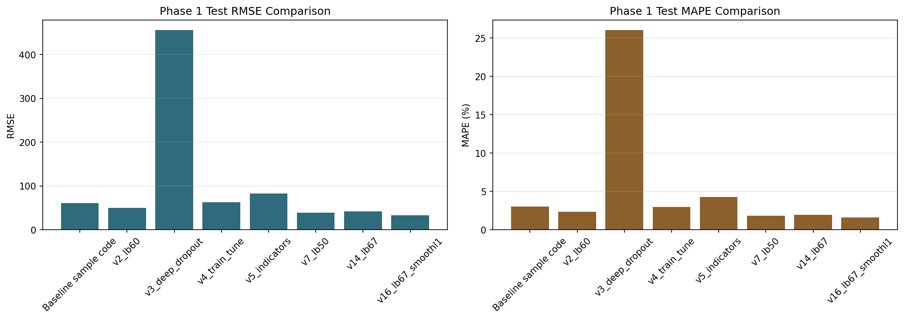
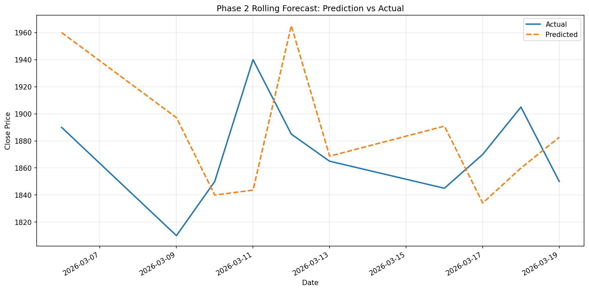
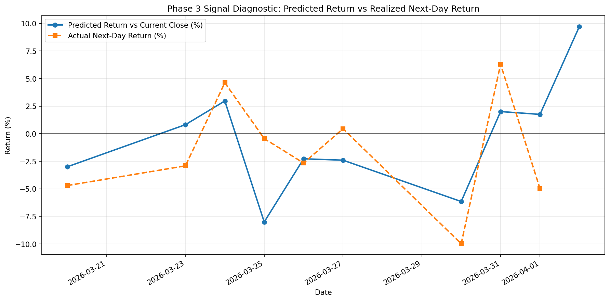
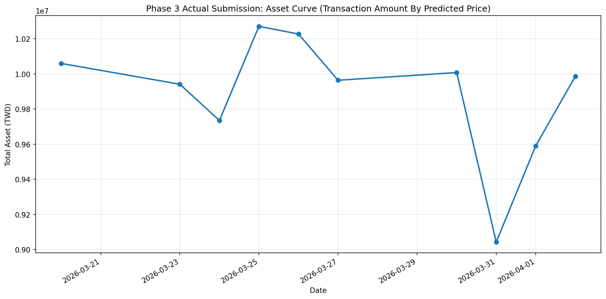
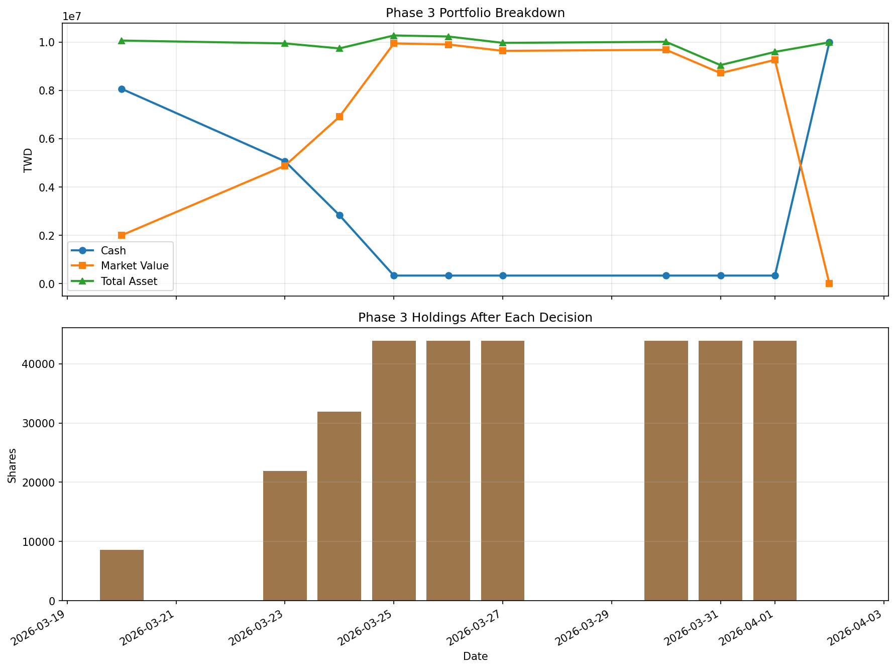
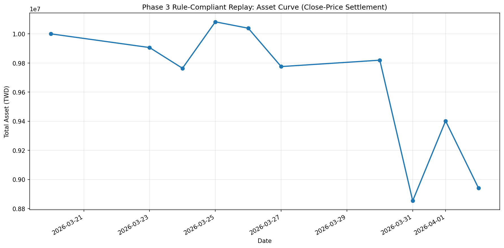
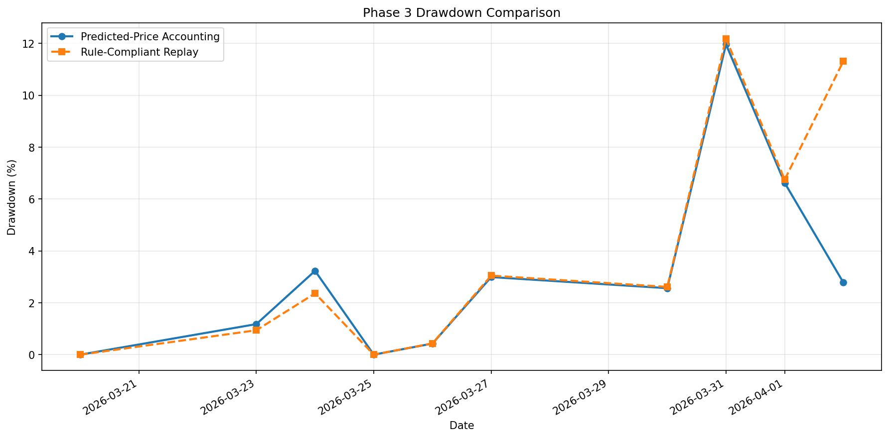

# Homework 1 作業報告 

- 學號：314831009
- 姓名：鐘家凱 Jiakai Zhong

## 一、作業目標與實驗設定

- 課程：RNN and Transformer
- 作業主題：以 LSTM + Attention 進行股價預測與交易決策分析
- Phase 1 / Phase 2 模型主線：`2330.TW`
- Phase 3 交易紀錄：`2408.TW`
- 最終模型：`v16_lb67_smoothl1`
- 最終模型設定：`look_back=67`、hidden sizes=`[128, 64]`、`SmoothL1Loss(beta=0.05)`、`learning rate=0.001`、`batch_size=32`、`epochs=50`
- 資料來源：Phase 1 / Phase 2 使用 Yahoo Finance 歷史日資料；Phase 3 使用 `2408.TW` 的交易紀錄與對應收盤價資料

本報告分別完成以下三個部分：

1. Phase 1：重現 baseline，並進行超參數與模型調整。
2. Phase 2：實作 rolling forecast，每次只預測下一個交易日。
3. Phase 3：整理實際提交的 10 日交易紀錄，檢查策略一致性、資金合法性與回測績效。

## 二、評估指標與計算方式

- `RMSE = sqrt(mean((y_true - y_pred)^2))`，用來衡量預測值與真實值的絕對誤差大小。
- `MAPE = mean(abs((y_true - y_pred) / y_true)) * 100%`，用來衡量相對誤差。
- `ROI = (Final Total Asset - Initial Capital) / Initial Capital * 100%`。
- `Max Drawdown = (Peak - Trough) / Peak * 100%`，其中 `Peak` 為資產曲線歷史高點。

## 三、Phase 1 模型調整與分析

### 3.1 Baseline 與最佳模型比較

依照以題目提供的 `Stock_predict.ipynb` 作為 baseline。

| 模型 | 說明 | Test RMSE | Test MAPE (%) |
| --- | --- | --- | --- |
| Baseline sample code | 題目提供的 Stock_predict.ipynb 預設設定 | 60.9182 | 3.0300 |
| v16_lb67_smoothl1 | 本次作業最終採用模型 | 32.9998 | 1.5700 |

相較於 baseline，最終模型的 `Test RMSE` 由 `60.9182` 降至 `32.9998`，`Test MAPE` 由 `3.03%` 降至 `1.57%`，顯示模型在絕對誤差與相對誤差兩個指標上皆有明顯改善。

### 3.2 代表性調參實驗整理

下表整理本次作業中具代表性的調整版本，涵蓋題目要求的三種以上調整面向：序列長度、模型結構 / dropout、訓練參數、特徵工程，以及 loss function。

| 模型 | 調整面向 | 主要調整內容 | Test RMSE | Test MAPE (%) |
| --- | --- | --- | --- | --- |
| Baseline sample code | 題目提供 baseline | 使用原始 notebook 預設參數 | 60.9182 | 3.0300 |
| v2_lb60 | 序列長度 | 將 look_back 由 100 調整為 60 | 49.9911 | 2.3300 |
| v3_deep_dropout | 模型結構 / Dropout | hidden 改為 [256,128,64]，dropout=0.2 | 456.2289 | 26.0400 |
| v4_train_tune | 訓練參數 | learning rate=0.0005，batch size=64，epochs=80 | 62.5129 | 2.9800 |
| v5_indicators | 特徵工程 | 加入 Close、MA5、MA20、RSI14 | 82.5861 | 4.2500 |
| v7_lb50 | 序列長度 | 將 look_back 調整為 50 | 38.7006 | 1.8100 |
| v14_lb67 | 序列長度 | 將 look_back 調整為 67 | 42.1649 | 1.9600 |
| v16_lb67_smoothl1 | 損失函數 | look_back=67，並將 loss 改為 SmoothL1Loss | 32.9998 | 1.5700 |

### 3.3 參數效果分析

- `look_back` 的影響最大。原始 baseline 使用較長視窗，容易引入較舊的價格資訊；改成 `50` 或 `67` 天後，泛化誤差明顯下降，表示較短至中等長度的時間窗更適合 `2330.TW` 的短期波動。
- 加深模型並額外加入 dropout 並沒有帶來改善。`v3_deep_dropout` 的結果遠差於 baseline，代表在此資料規模與任務設定下，模型複雜度過高反而導致學習不穩定。
- 單純加入 `MA5`、`MA20`、`RSI14` 並未有效提升表現。這與題目 PDF 的提醒一致：若特徵設計與尺度處理不夠精細，額外技術指標可能引入噪音而不是訊號。
- 最有效的改進來自 `SmoothL1Loss`。在 `look_back=67` 的基礎上將 `MSELoss` 換成 `SmoothL1Loss` 後，模型對單日大波動更不敏感，因此整體測試誤差下降最多，成為最後採用的版本。

### 3.4 最終模型重現結果

為了確認 notebook 可重現性，我在最終繳交版本中重新訓練一次最終模型，重現結果如下：

- Train RMSE：`13.3568`
- Train MAE：`9.3508`
- Train MAPE：`2.30%`
- Test RMSE：`32.9998`
- Test MAE：`25.1240`
- Test MAPE：`1.57%`

## 四、Phase 2 Rolling Forecast Simulation

依照題目說明，我選擇 **2026-03-06 至 2026-03-19** 這 10 個歷史交易日作為 rolling forecast 觀察區間。實作流程如下：

1. 使用第一個目標日之前的所有歷史資料訓練模型。
2. 只預測下一個交易日的收盤價，而不是一次預測多天。
3. 取得真實收盤價後，將該日資料加入訓練集合。
4. 進行 daily update 後，再預測下一個交易日。

- Rolling Forecast RMSE：`59.0017`
- Rolling Forecast MAPE：`2.70%`

| 日期 | 前一日收盤價 | 預測收盤價 | 實際收盤價 | 絕對誤差 | 預測報酬率 (%) | 實際報酬率 (%) |
| --- | --- | --- | --- | --- | --- | --- |
| 2026-03-06 | 1900.0000 | 1960.0239 | 1890.0000 | 70.0239 | 3.1592 | -0.5263 |
| 2026-03-09 | 1890.0000 | 1897.1674 | 1810.0000 | 87.1674 | 0.3792 | -4.2328 |
| 2026-03-10 | 1810.0000 | 1839.9779 | 1850.0000 | 10.0221 | 1.6562 | 2.2099 |
| 2026-03-11 | 1850.0000 | 1843.6584 | 1940.0000 | 96.3416 | -0.3428 | 4.8649 |
| 2026-03-12 | 1940.0000 | 1965.1437 | 1885.0000 | 80.1437 | 1.2961 | -2.8351 |
| 2026-03-13 | 1885.0000 | 1868.7180 | 1865.0000 | 3.7180 | -0.8638 | -1.0610 |
| 2026-03-16 | 1865.0000 | 1890.9083 | 1845.0000 | 45.9083 | 1.3892 | -1.0724 |
| 2026-03-17 | 1845.0000 | 1834.1260 | 1870.0000 | 35.8740 | -0.5894 | 1.3550 |
| 2026-03-18 | 1870.0000 | 1859.9512 | 1905.0000 | 45.0488 | -0.5374 | 1.8717 |
| 2026-03-19 | 1905.0000 | 1882.6753 | 1850.0000 | 32.6753 | -1.1719 | -2.8871 |

由圖與表可見，模型在部分下跌日具有一定方向性，但在急速反彈區段，例如 `2026-03-11` 與 `2026-03-12`，預測明顯落後。這反映出序列模型對突發反轉的反應速度有限，也說明 rolling forecast 雖然更貼近真實場景，但難度顯著高於固定 test split。

## 五、Phase 3 交易紀錄整理（2408）

本段不再使用模擬交易，而是直接整理 `2408.TW` 的 10 日交易紀錄與對應資產變化。

### 5.1 紀錄解讀方式

- `Price` 欄：視為當日提交時的模型預測價格。
- `Action` 與 `Quantity` 欄：視為當日實際提交的交易指令。
- 本報告主表中的 `交易金額` 以**預測價格**計算，以對應實際提交欄位中的預測值。
- 另建立一個「符合作業規則的 replay」版本，改用**收盤價結算**並強制遵守 no-overdraft / no-short-selling。

### 5.2 模型訊號與實際操作一致性

以下表格將 `預測價格` 與 `當日收盤價` 比較，用以推導模型在當日隱含的方向訊號；若預測價高於當日收盤價超過 `0.5%`，視為偏多訊號；若低於 `0.5%` 以上，視為偏空訊號；其餘視為觀望。

| 日期 | 預測價格 | 當日收盤價 | 次日實際收盤價 | 模型預測漲跌幅 (%) | 模型推導操作 | 實際提交操作 | 是否一致 | 說明 |
| --- | --- | --- | --- | --- | --- | --- | --- | --- |
| 2026-03-20 | 226.9800 | 234.0000 | 223.0000 | -3.0000 | 賣出 | 買進 | 否 | 提交操作與模型方向不一致 |
| 2026-03-23 | 224.8300 | 223.0000 | 216.5000 | 0.8206 | 買進 | 買進 | 是 | 與模型方向一致 |
| 2026-03-24 | 222.9300 | 216.5000 | 226.5000 | 2.9700 | 買進 | 買進 | 是 | 與模型方向一致 |
| 2026-03-25 | 208.3700 | 226.5000 | 225.5000 | -8.0044 | 賣出 | 買進 | 否 | 提交操作與模型方向不一致 |
| 2026-03-26 | 220.3700 | 225.5000 | 219.5000 | -2.2749 | 賣出 | 觀望 | 否 | 提交操作與模型方向不一致 |
| 2026-03-27 | 214.2300 | 219.5000 | 220.5000 | -2.4009 | 賣出 | 觀望 | 否 | 提交操作與模型方向不一致 |
| 2026-03-30 | 206.9400 | 220.5000 | 198.5000 | -6.1497 | 賣出 | 觀望 | 否 | 提交操作與模型方向不一致 |
| 2026-03-31 | 202.4900 | 198.5000 | 211.0000 | 2.0101 | 買進 | 觀望 | 否 | 提交操作與模型方向不一致 |
| 2026-04-01 | 214.7000 | 211.0000 | 200.5000 | 1.7536 | 買進 | 觀望 | 否 | 提交操作與模型方向不一致 |
| 2026-04-02 | 220.0000 | 200.5000 |  | 9.7257 | 期末平倉 | 賣出 | 是 | 期末依作業規則平倉 |

- 可比較交易日數：`9`
- 與模型方向一致的交易日數：`2`
- 一致率：`22.22%`
- 預測價格對次日真實收盤價的平均 MAPE：`3.71%`

從一致性表可見，這份實際提交紀錄並非完全機械式地跟隨模型訊號，尤其在部分預測價低於當日收盤價的情況下，仍選擇繼續買進或持有，顯示實際操作混入了主觀判斷。

### 5.3 實際交易紀錄（依預測價格記帳）

下表依你的要求，將交易金額、現金餘額的計算基準設為 `預測價格`；但持股市值與總資產仍以當日收盤價 mark-to-market，方便觀察實際風險。

| 日期 | 工作表 | 預測價格 | 當日收盤價 | 操作 | 股數 | 交易金額（依預測價格） | 現金餘額 | 持股數 | 總資產 |
| --- | --- | --- | --- | --- | --- | --- | --- | --- | --- |
| 2026-03-20 | Day 1 | 226.9800 | 234.0000 | 買進 | 8547 | 1939998.0600 | 8060001.9400 | 8547 | 10059999.9400 |
| 2026-03-23 | Day 2 | 224.8300 | 223.0000 | 買進 | 13343 | 2999906.6900 | 5060095.2500 | 21890 | 9941565.2500 |
| 2026-03-24 | Day 3 | 222.9300 | 216.5000 | 買進 | 10000 | 2229300.0000 | 2830795.2500 | 31890 | 9734980.2500 |
| 2026-03-25 | Day 4 | 208.3700 | 226.5000 | 買進 | 12000 | 2500440.0000 | 330355.2500 | 43890 | 10271440.2500 |
| 2026-03-26 | Day 5 | 220.3700 | 225.5000 | 觀望 | 0 | 0.0000 | 330355.2500 | 43890 | 10227550.2500 |
| 2026-03-27 | Day 6 | 214.2300 | 219.5000 | 觀望 | 0 | 0.0000 | 330355.2500 | 43890 | 9964210.2500 |
| 2026-03-30 | Day 7 | 206.9400 | 220.5000 | 觀望 | 0 | 0.0000 | 330355.2500 | 43890 | 10008100.2500 |
| 2026-03-31 | Day 8 | 202.4900 | 198.5000 | 觀望 | 0 | 0.0000 | 330355.2500 | 43890 | 9042520.2500 |
| 2026-04-01 | Day 9 | 214.7000 | 211.0000 | 觀望 | 0 | 0.0000 | 330355.2500 | 43890 | 9591145.2500 |
| 2026-04-02 | Day 10 | 220.0000 | 200.5000 | 賣出 | 43890 | 9655800.0000 | 9986155.2500 | 0 | 9986155.2500 |

- 初始資金：`10000000` TWD
- 最終總資產：`9986155` TWD
- ROI：`-0.14%`
- Max Drawdown：`11.96%`
- 最大負現金：`0` TWD

以這份交易紀錄計算後，預測價格記帳版本未出現負現金或超額賣出；但整體績效仍接近損益兩平，顯示即使資金約束成立，策略報酬仍然有限。

### 5.4 符合作業規則的合法 replay（依收盤價結算）

為了對照作業 rubric，我額外做了一個合法 replay，並在每個交易日強制套用兩個限制。

1. 買進股數不得超過現金可負擔上限。
2. 賣出股數不得超過當前持股。

| 日期 | 預測價格 | 收盤價結算 | 原始操作 | 原始股數 | 合法 replay 操作 | 合法 replay 股數 | 交易金額（依收盤價） | 現金餘額 | 持股數 | 總資產 |
| --- | --- | --- | --- | --- | --- | --- | --- | --- | --- | --- |
| 2026-03-20 | 226.9800 | 234.0000 | 買進 | 8547 | 買進 | 8547 | 1999998.0000 | 8000002.0000 | 8547 | 10000000.0000 |
| 2026-03-23 | 224.8300 | 223.0000 | 買進 | 13343 | 買進 | 13343 | 2975489.0000 | 5024513.0000 | 21890 | 9905983.0000 |
| 2026-03-24 | 222.9300 | 216.5000 | 買進 | 10000 | 買進 | 10000 | 2165000.0000 | 2859513.0000 | 31890 | 9763698.0000 |
| 2026-03-25 | 208.3700 | 226.5000 | 買進 | 12000 | 買進 | 12000 | 2718000.0000 | 141513.0000 | 43890 | 10082598.0000 |
| 2026-03-26 | 220.3700 | 225.5000 | 觀望 | 0 | 觀望 | 0 | 0.0000 | 141513.0000 | 43890 | 10038708.0000 |
| 2026-03-27 | 214.2300 | 219.5000 | 觀望 | 0 | 觀望 | 0 | 0.0000 | 141513.0000 | 43890 | 9775368.0000 |
| 2026-03-30 | 206.9400 | 220.5000 | 觀望 | 0 | 觀望 | 0 | 0.0000 | 141513.0000 | 43890 | 9819258.0000 |
| 2026-03-31 | 202.4900 | 198.5000 | 觀望 | 0 | 觀望 | 0 | 0.0000 | 141513.0000 | 43890 | 8853678.0000 |
| 2026-04-01 | 214.7000 | 211.0000 | 觀望 | 0 | 觀望 | 0 | 0.0000 | 141513.0000 | 43890 | 9402303.0000 |
| 2026-04-02 | 220.0000 | 200.5000 | 賣出 | 43890 | 賣出 | 43890 | 8799945.0000 | 8941458.0000 | 0 | 8941458.0000 |

- 合法 replay 最終總資產：`8941458` TWD
- 合法 replay ROI：`-10.59%`
- 合法 replay Max Drawdown：`12.19%`
- 被資金 / 持股限制截斷的交易日數：`0`

此版本的 replay 沒有出現額外的超額買進或超額賣出裁切。它說明了在符合作業規則的前提下，策略雖可維持合規，但最終報酬仍未顯著改善。

### 5.5 Phase 3 輸損原因分析

- 第一，模型訊號與實際操作之間缺乏一致的執行規則。可比較交易日中，只有 `22.22%` 的操作與模型方向一致，代表最終績效不只是模型預測結果，也受到人工判斷影響。
- 第二，倉位在前四天快速堆高。到 `2026-03-25` 為止，持股已累積至 `43,890` 股，主表現金僅剩 `330,355` TWD，合法 replay 現金也只剩 `141,513` TWD，代表組合已接近高曝險狀態。
- 第三，下跌期間缺乏減碼機制。`2026-03-26` 到 `2026-04-01` 幾乎都維持原部位不動，使資產從高點回落到 `9,042,520` TWD，形成 `11.96%` 的最大回撤。
- 第四，期末才一次性出場，使虧損在最後結算日被實現。若依作業規則用收盤價結算，最終總資產降為 `8,941,458` TWD，顯示真實可執行結果比預測價格記帳版本更差。

綜合來看，Phase 3 的虧損並不是單一預測失誤造成，而是「訊號沒有被穩定執行」、「前期加碼過快」、「下跌時未減碼」三者共同造成的結果。

## 六、反思與討論

- 就 Phase 1 / Phase 2 而言，`v16_lb67_smoothl1` 相比 baseline 明顯降低了 `2330.TW` 的測試誤差，證明 `look_back` 與 loss function 的調整確實有效。
- 就 Phase 3 而言，`2408.TW` 的整體策略表現仍不理想。無論是以預測價格記帳，還是以作業規則的收盤價 replay，報酬都沒有明顯優勢。
- 訊號一致性分析顯示，實際操作並非完全跟隨模型方向，因此交易績效不能單純歸因於模型本身，還包含了主觀判斷的影響。
- 合法 replay 的價值在於把「實際提交內容」和「作業規則下可執行內容」分開。這能更清楚地說明：模型可以有參考價值，但策略若沒有資金上限與執行規則，仍然會在實務上失敗。
- 若後續要繼續優化，我會優先做三件事：第一，把現金上限直接寫進下單邏輯；第二，建立模型訊號到交易動作的固定映射規則；第三，避免在短期內對單一標的連續過度加碼，以降低單一股票回撤對總資產的傷害。
