# Homework 2 作業報告

- 學號：314831009
- 姓名：鐘家凱 Jiakai Zhong

## 一、作業目標與實驗設定

- 課程：RNN and Transformer
- 作業主題：AI-generated text detection 與 local LLM adversarial rewriting analysis
- 資料集：`DAIGT V2`
- 清理後資料筆數：`44864`
- 標籤定義：`0 = Human`、`1 = AI`
- 共用資料切分：`seed=42`、stratified `80/20` train/validation split
- Baseline 模型：
  - `word bi-gram TF-IDF + LogisticRegression`
  - `char 3-5 gram TF-IDF + LogisticRegression`
- BERT 模型：
  - `bert-base-cased`
  - `bert-large-cased`
- Local generation model：`Meta-Llama-3-8B-Instruct`
- Detector for attack evaluation：`bert-large-cased`

本作業依照題目要求完成四個重點部分：

1. Part 1：完成資料整理、EDA 與傳統 baseline。
2. Part 2：以相同 split 比較 `bert-base-cased` 與 `bert-large-cased`。
3. Part 3：使用 local LLM 進行 adversarial rewriting attack。
4. Part 4：統整實驗結果，分析 detector 有效的原因、attack 失敗的原因，以及本作業的限制。

本次實驗的核心原則是三個模型流程共用同一份清理後資料與同一份 split，不讓不同模型各自重新切資料，避免比較失真。資料前處理、split、baseline、BERT、attack 都已經固定落檔，因此整份作業可重現。

## 二、評估指標與實驗流程

### 2.1 評估指標

- `Accuracy = correct predictions / total samples`
- `Precision = TP / (TP + FP)`
- `Recall = TP / (TP + FN)`
- `F1 = 2 * Precision * Recall / (Precision + Recall)`
- `ROC-AUC` 使用模型輸出的 probability score 計算，不使用 hard label
- `Attack Success Rate = rewrite 後被 detector 判為 Human 的比例`

在本作業中，`ROC-AUC` 是最重要的整體區分指標，因為它能反映模型在不同 threshold 下的辨識能力；而在 attack 實驗中，除了 success rate 之外，我也追蹤 rewrite 前後的 AI probability 變化，觀察 detector 分數是上升還是下降。

### 2.2 實驗流程

整體流程如下：

1. 載入 `DAIGT V2`，保留 `text` 與 `label` 欄位。
2. 去除空值、空字串與 exact duplicate。
3. 建立固定的 stratified `80/20` split，輸出為 `outputs/splits/train_val_split_seed42.json`。
4. 在相同 split 上完成 `EDA.py`、`Baseline.py`、`BERT.py` 與 `LocalLLM.py`。
5. 由 `bert-large-cased` 最佳 detector 來評估 LLM rewrite attack。

這個流程確保所有結果都建立在同一份資料分割上，因此 baseline、BERT 與 attack 之間的比較具有一致性。

## 三、資料整理與 EDA

### 3.1 資料整理流程

資料主檔為 `train_v2_drcat_02.csv`。前處理步驟如下：

- 只保留 `text` 與 `label`
- 將 `text` 轉成字串並移除前後空白
- 去除空值與空字串
- 去除 exact duplicate，重複定義為相同 `(text, label)`
- 建立固定 split：
  - `seed=42`
  - stratified `80/20`

清理後資料共有 `44864` 筆，其中：

- Human：`27367`
- AI：`17497`
- train：`35891`
- validation：`8973`

### 3.2 主要統計結果

- overall truncation rate：`0.2865`
- Human truncation rate：`0.4034`
- AI truncation rate：`0.1036`
- Human median word count：`388`
- AI median word count：`334`
- Human median token length：`456`
- AI median token length：`400`
- Human median vocabulary richness：`0.4374`
- AI median vocabulary richness：`0.4531`

本作業中，`vocabulary richness` 定義為：

- `unique tokens / total tokens`

也就是一篇文章中，不重複詞數占總詞數的比例。此值越高，代表在相同篇幅下使用的不同詞彙比例越高。

### 3.3 EDA 圖與觀察

#### 3.3.1 Class Balance

資料集並非完全平衡，Human essays 數量明顯多於 AI essays，因此 train/validation split 必須採用 stratified split，才能維持評估的穩定性。

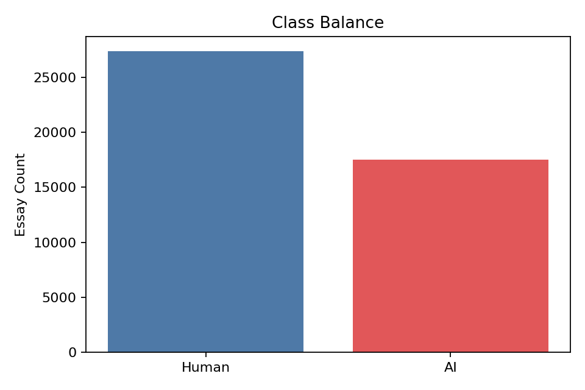

#### 3.3.2 Word Count Distribution

Human essays 的字數分布整體更靠右，代表平均篇幅較長，且變異也較大；AI essays 的篇幅則相對集中。這表示文本長度本身就是一個有效訊號，也能部分解釋為什麼 TF-IDF baseline 已經很強。

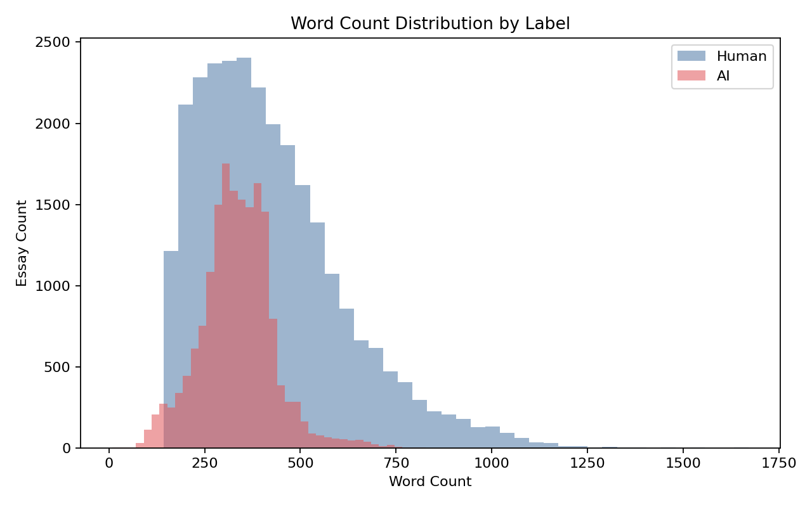

#### 3.3.3 Word Count Boxplot

從 boxplot 可以更清楚看出 Human essays 的中位數較高，四分位距與長尾也更明顯。這說明 Human 文本在篇幅與寫作展開方式上，通常比 AI 文本有更大的變異。

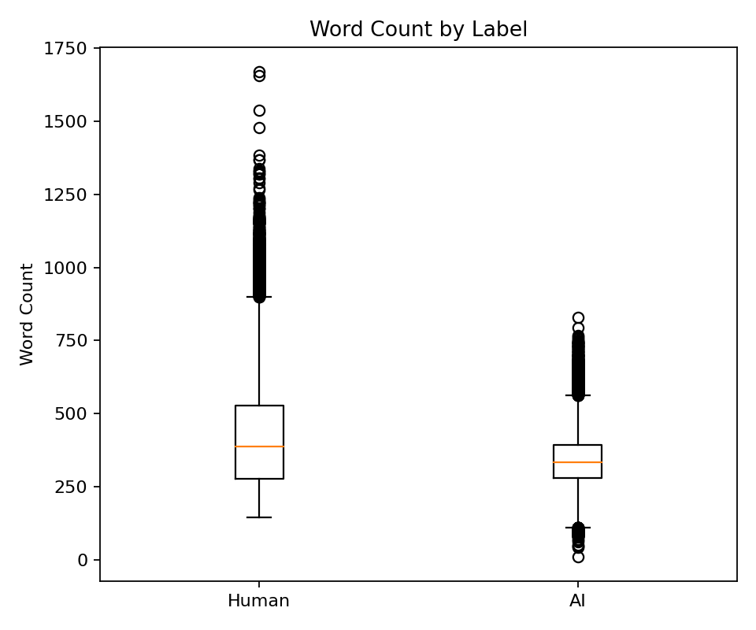

#### 3.3.4 Vocabulary Richness

`Vocabulary richness` 的結果顯示，AI essays 的中位數略高於 Human essays。這代表在這份資料上，AI 文本並不一定比較單調；相反地，Human essays 雖較長，但也可能因為重複敘述、口語化與贅述而讓這個比例下降。這提醒我們不能只靠直覺判斷文本是否為 AI。

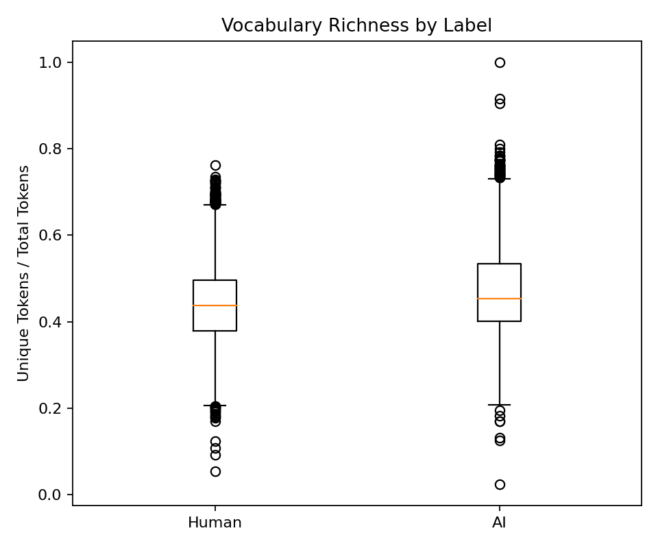

#### 3.3.5 Tokenizer Length 與 Truncation

在 `bert-base-cased` tokenizer 下，Human essays 的 token length 明顯更高，而且長尾更長，對應到更高的 truncation rate。Human essays 的截斷率為 `40.34%`，明顯高於 AI essays 的 `10.36%`。這表示後續 BERT detector 在固定 `512` tokens 的條件下，更常只看到 Human 長文的前半段內容，因此截斷效應是後續模型分析中必須說明的限制。

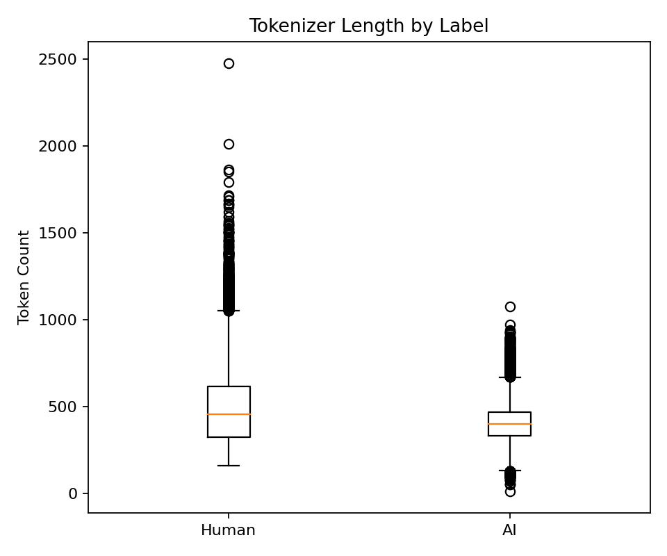

### 3.4 定性文本觀察

定性檢視代表性文本後，可以觀察到 Human essays 通常篇幅較長、換段較多、句子節奏較不平整，也更常保留拼字錯誤、重複、口語接續詞與局部不自然轉折；相對地，AI essays 雖然同樣可讀，但句式通常更整齊、論述更集中、過渡更順、表面語法也更穩定。這些差異和前述長度與 richness 的結果一致，代表 Human 與 AI 之間的差異不只存在於單一統計量，而是同時出現在篇幅、結構與表面文風上。

### 3.5 統計檢定

為了確認 EDA 中觀察到的差異不是視覺錯覺，我使用 Mann-Whitney U test 比較 Human 與 AI 在 `word_count`、`vocabulary_richness` 與 `token_length` 上的分布差異。結果如下：

| 指標 | Human Median | AI Median | p-value | Rank-biserial Effect |
| --- | ---: | ---: | ---: | ---: |
| word_count | 388.0000 | 334.0000 | 0.0000e+00 | 0.2456 |
| vocabulary_richness | 0.4374 | 0.4531 | 4.2959e-190 | -0.1643 |
| token_length | 456.0000 | 400.0000 | 0.0000e+00 | 0.2247 |

三個指標的 p-value 都遠小於 `0.001`，表示 Human 與 AI 文本在這些分布上具有顯著統計差異。因此本作業中的 EDA 並不是單純視覺印象，而是有統計支持的結論。

## 四、Part 1：TF-IDF Baseline

### 4.1 Baseline 設定

本作業使用兩組傳統機器學習 baseline：

1. `word bi-gram TF-IDF + LogisticRegression`
2. `char 3-5 gram TF-IDF + LogisticRegression`

兩個 baseline 都使用同一份 train/validation split，並以 validation probability 計算 `ROC-AUC`。

### 4.2 整體結果

| 模型 | Accuracy | Precision | Recall | F1 | ROC-AUC |
| --- | ---: | ---: | ---: | ---: | ---: |
| Word TF-IDF + LR | 0.992756 | 0.999128 | 0.982281 | 0.990633 | 0.999222 |
| Char TF-IDF + LR | 0.992087 | 0.997388 | 0.982281 | 0.989777 | 0.999067 |

結果顯示兩個 baseline 都非常強，而 `word bi-gram TF-IDF + LogisticRegression` 在所有主要指標上都略優於 char baseline，因此我將它視為本作業中較強的傳統 baseline。

### 4.3 Classification Report

從分類報告來看，兩個 baseline 都能非常穩定地辨識兩類文本。`word` baseline 的 class-wise 表現如下：

| 類別 | Precision | Recall | F1 | Support |
| --- | ---: | ---: | ---: | ---: |
| Human | 0.988795 | 0.999452 | 0.994095 | 5474 |
| AI | 0.999128 | 0.982281 | 0.990633 | 3499 |

`char` baseline 的 class-wise 表現如下：

| 類別 | Precision | Recall | F1 | Support |
| --- | ---: | ---: | ---: | ---: |
| Human | 0.988782 | 0.998356 | 0.993546 | 5474 |
| AI | 0.997388 | 0.982281 | 0.989777 | 3499 |

可以看到兩個 baseline 都對 Human 類別有非常高的 recall，而對 AI 類別也維持很高的 precision 與 recall。這代表模型並不是靠單一偏置就取得高分，而是確實能在兩類文本之間建立穩定區分。

### 4.4 ROC Curve 與 Confusion Matrix

下圖分別呈現兩個 baseline 的 ROC curve 與 confusion matrix。

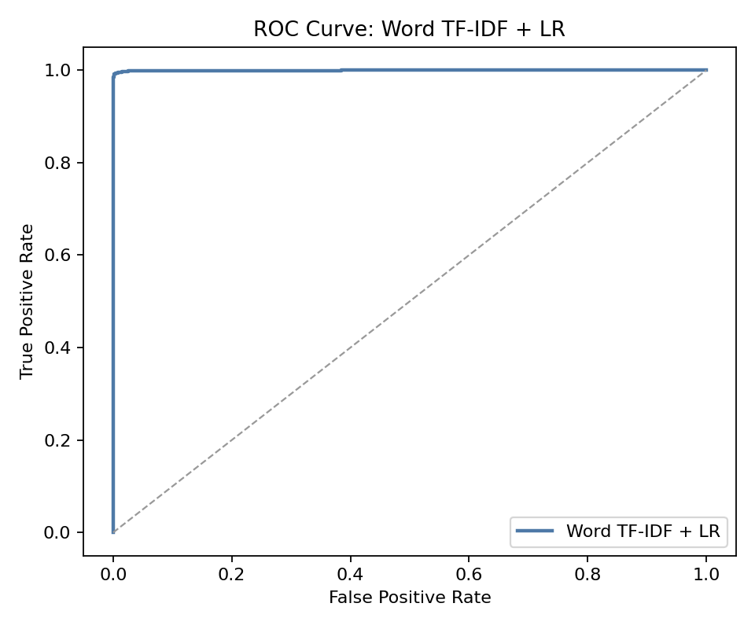

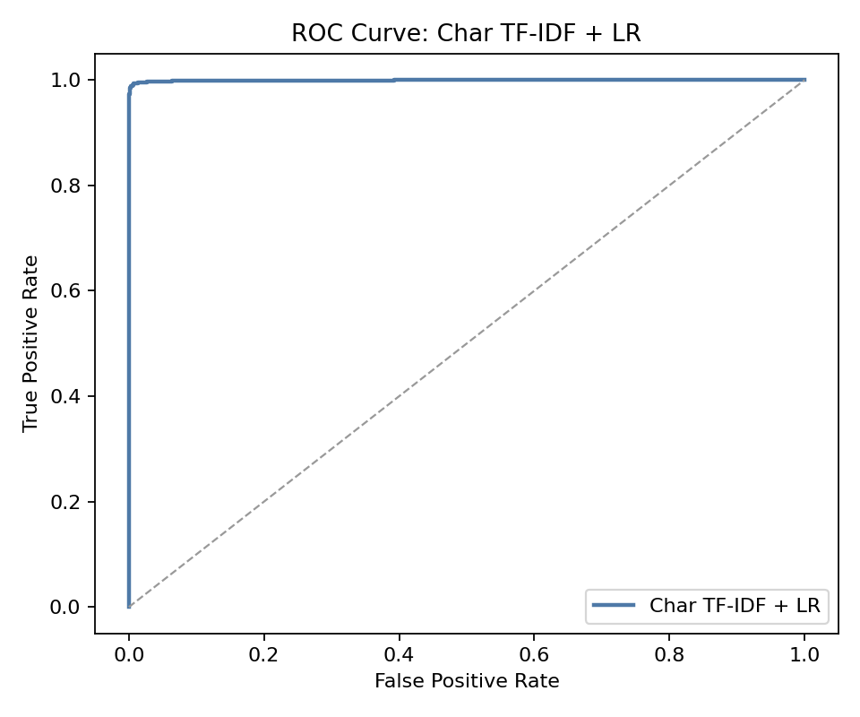

兩條 ROC curve 都幾乎貼近左上角，對應到 `0.999` 等級的 ROC-AUC，表示模型在不同 threshold 下都有很強的區分能力。

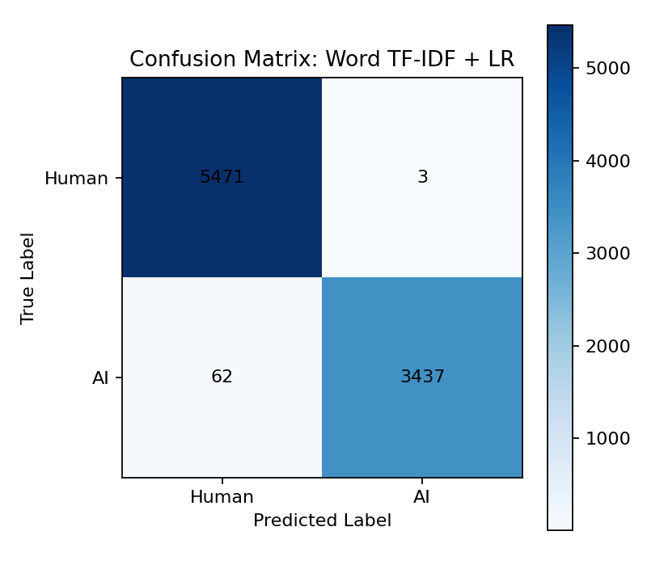

Confusion matrix 顯示，兩個 baseline 的主要錯誤型態都不是大量混淆，而是少數邊界樣本的誤判。整體來看，這兩個模型已經足以作為非常強的比較基準。

### 4.5 Baseline 分析

本作業中 baseline 分數非常高，因此我特別檢查是否存在資料洩漏。結果顯示：

- train rows：`35891`
- validation rows：`8973`
- unique train texts：`35891`
- unique val texts：`8973`
- exact text overlap between train and val：`0`

也就是說，train 與 validation 間沒有 exact duplicate text overlap，因此 baseline 高分並不是因為重複文本外洩。

另外，這份資料上不是 char baseline 特別高，而是 word baseline 還略高於 char baseline。這代表模型效能並非只依賴字元層級的表面模式，而是 lexical choice、短語搭配與局部結構本身就帶有很強的可分訊號。換句話說，這份資料的 Human/AI 差異確實很強，因此 baseline 高分是合理的。

## 五、Part 2：BERT Fine-tuning 與比較

### 5.1 模型設定

本作業比較兩個 BERT detector：

- `bert-base-cased`
- `bert-large-cased`

共同設定如下：

- `max_length = 512`
- `effective batch size = 32`
- 使用相同 train/validation split
- 使用相同 label 定義
- 以 validation probability 計算 `ROC-AUC`

其中：

- `bert-large-cased` 額外啟用 `gradient checkpointing`
- 訓練採用 mixed precision
- 為了確認結果不是單一 seed 偶然造成，我補跑了 `seed=42` 與 `seed=7`

### 5.2 Seed 42 與 Seed 7 結果

| 模型 | Seed | Accuracy | F1 | ROC-AUC | Runtime (s) |
| --- | ---: | ---: | ---: | ---: | ---: |
| bert-base-cased | 42 | 0.991419 | 0.989076 | 0.999605 | 541.80 |
| bert-base-cased | 7 | 0.991530 | 0.989192 | 0.999629 | 388.61 |
| bert-large-cased | 42 | 0.995765 | 0.994576 | 0.999755 | 1460.69 |
| bert-large-cased | 7 | 0.993202 | 0.991327 | 0.999741 | 1419.50 |

從結果來看，`bert-large-cased` 在兩個 seed 上都略優於 `bert-base-cased`，但提升幅度不大，主要集中在 Accuracy 與 F1；ROC-AUC 的提升只有 `1e-4` 等級。

### 5.3 訓練曲線

下圖為 `seed=42` 下的 training history。

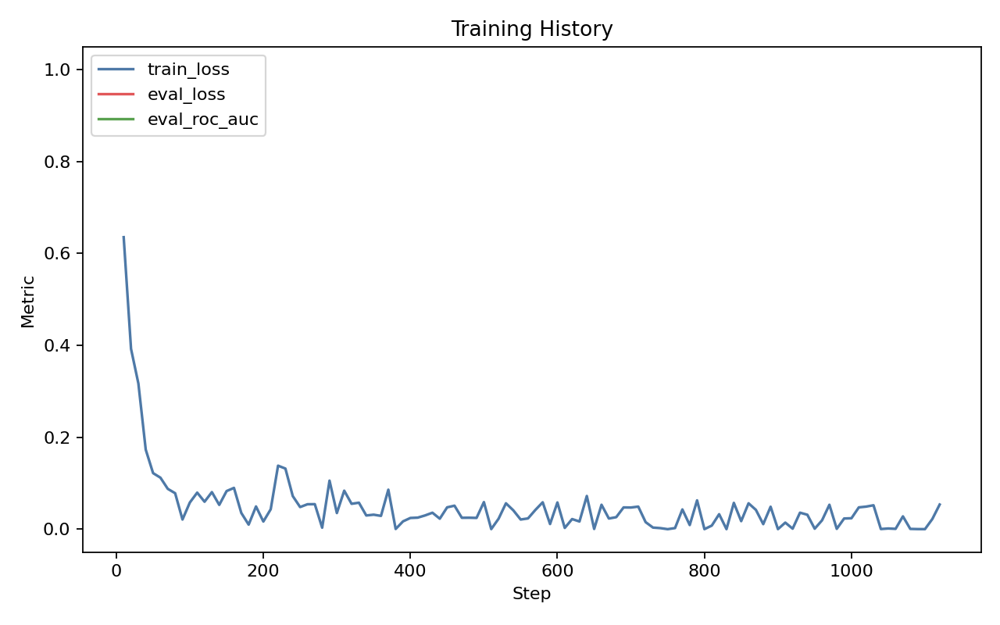

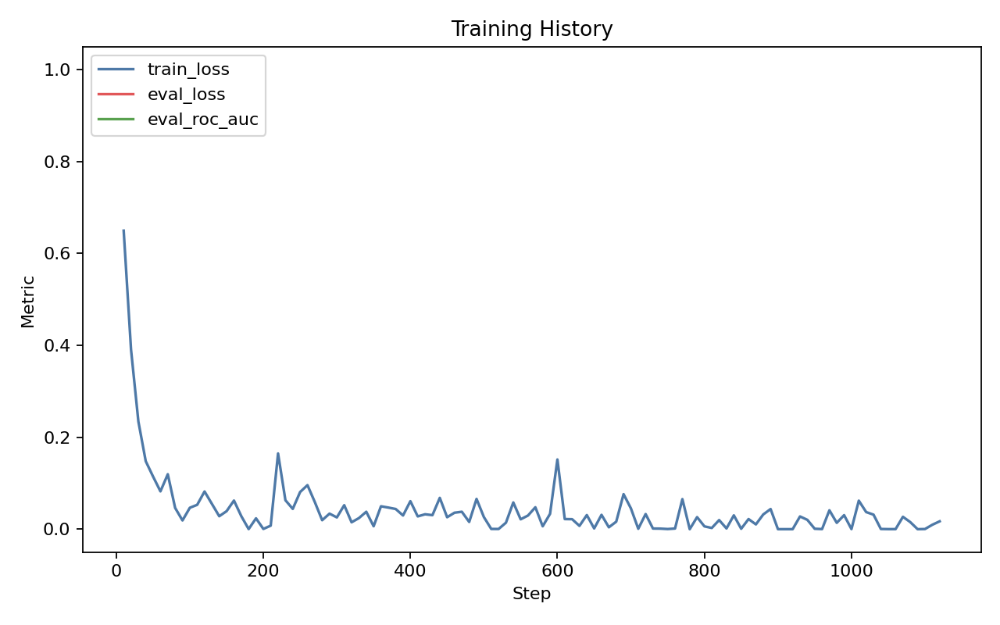

從圖上可以看到兩個模型都收斂得相當快，驗證表現也很早就到達高點。這和 baseline 已經非常強的結果一致，代表這份任務對 detector 而言本身就具有大量可學習訊號。

### 5.4 BERT 分析

這部分的主要結論有三點。

第一，`bert-large-cased` 是本作業的最佳 detector。若只追求 validation 上的最高分數，large 模型在兩個 seed 上都勝過 base。

第二，`bert-large-cased` 的成本明顯更高。它的訓練時間約為 `bert-base-cased` 的 `2.6x` 到 `3.7x`，但 ROC-AUC 的提升非常有限。因此若從成本效益來看，`bert-base-cased` 已經是很強且相當划算的選擇。

第三，儘管 Human 文本有較高 truncation rate，BERT 仍然表現非常好，表示在前 `512` tokens 內就已經包含大量可區分訊號。這也暗示 detector 不一定需要讀完整篇文章，就足以辨識文風與結構差異。

## 六、Part 3：Local LLM Adversarial Attack

### 6.1 Attack 設定

為了測試 detector 是否能被 local LLM 改寫繞過，我從 validation 中挑選原本被 detector 正確判為 Human 的 Human essays，交由 `Meta-Llama-3-8B-Instruct` 改寫，再交回 `bert-large-cased` detector 評估。

Detector 使用：

- `outputs/bert/bert-large-cased/seed42/bs8_ga4/best_model`

Generation model 使用：

- `models/Meta-Llama-3-8B-Instruct`

### 6.2 第一輪 Attack

第一輪使用兩個 prompt：

- `student_voice`
- `natural_imperfect`

結果如下：

- source essays：`10`
- attack samples：`20`
- overall attack success rate：`0.0`
- mean original AI probability：`0.000115`
- mean rewritten AI probability：`0.999952`

第一輪已經顯示非常明確的現象：原本文本幾乎都被 detector 判為 Human，但一旦經過 Llama 改寫，反而被高信心判成 AI。

### 6.3 第二輪 Stealth Attack

第二輪為了降低 rewrite 的 LLM 味道，改用較保守的 prompt 與 generation 參數：

- prompt set：`stealth`
- prompts：
  - `minimal_edit`
  - `messy_student`
  - `lighter_revision`
- `max_new_tokens = 384`
- `temperature = 0.6`
- `top_p = 0.9`
- `repetition_penalty = 1.1`

結果如下：

- source essays：`10`
- attack samples：`30`
- overall attack success rate：`0.0`
- mean original AI probability：`0.000115`
- mean rewritten AI probability：`0.999950`

各 prompt 的 mean rewritten AI probability：

- `minimal_edit`：`0.999888`
- `messy_student`：`0.999979`
- `lighter_revision`：`0.999982`

第二輪依然全面失敗，而且三種 prompt 中只有 `minimal_edit` 稍微比較不失敗，但距離成功仍然非常遠。

### 6.4 Attack 圖與說明

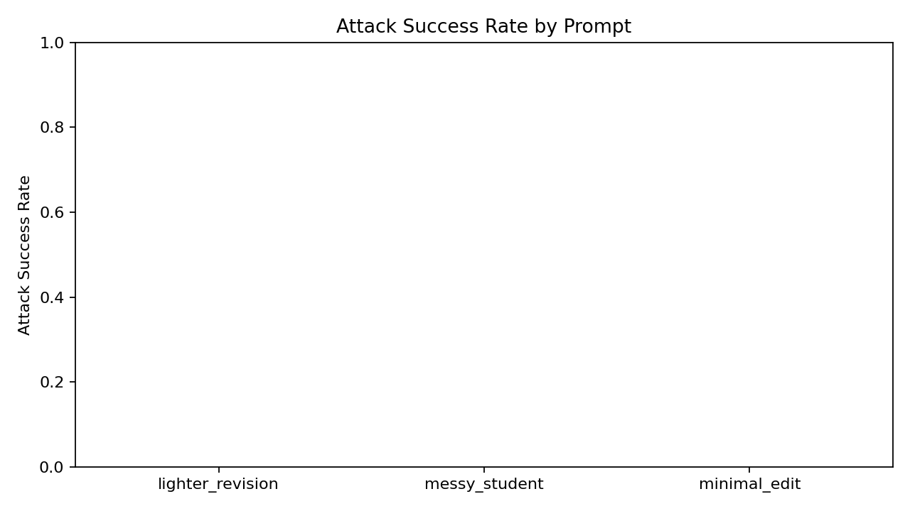

這張圖看起來幾乎像空白圖，原因不是繪圖失敗，而是三個 prompt 的 success rate 全部都是 `0`，長條都貼在 x 軸上。

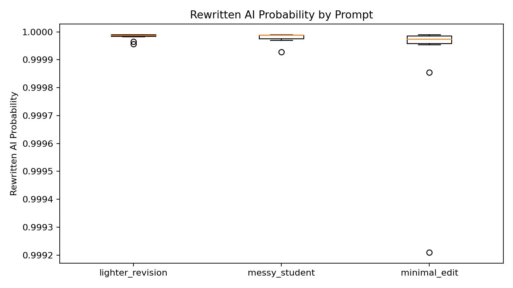

這張圖顯示 rewrite 後的 AI probability 幾乎全部集中在 `1.0` 附近，表示 detector 對這種 Llama-style rewrite 非常敏感。

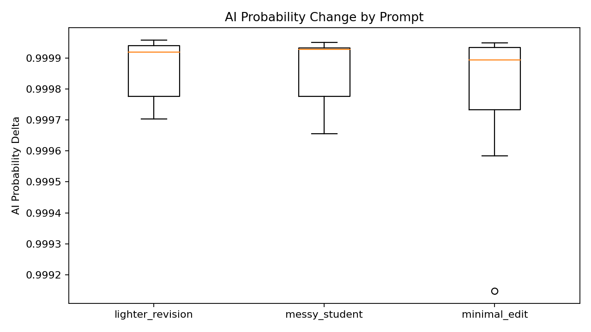

這張圖則顯示 rewrite 後分數不是稍微偏移，而是大幅上升到 AI 端。這代表本次 attack 的主要結果不是「接近成功卻差一點」，而是「改寫本身直接暴露出更強的 AI 訊號」。

## 七、Part 4 Analysis Report

### 7.1 整體結果統整

本作業最重要的結果可以整理成四點。

第一，這份資料集上的 Human 與 AI 文本具有非常強的表面差異。從 EDA、TF-IDF baseline 到 BERT，都一致顯示任務本身有大量可分訊號。

第二，baseline 已經非常強。這使得 BERT 雖然仍有提升，但增益空間有限；換言之，這不是一個只有大型深度模型才能處理的任務。

第三，`bert-large-cased` 雖是最佳 detector，但它的優勢主要體現在 Accuracy 與 F1，而不是明顯壓倒性的 ROC-AUC 提升。因此在實務上是否值得使用 large，需要看是否在乎那一點點額外增益。

第四，本作業中的 local LLM rewrite attack 完全失敗，而且不是險些成功，而是幾乎所有改寫文本都被 detector 以接近 `1.0` 的機率判成 AI。這使得 attack 實驗的價值，從「證明可繞過 detector」轉變成「分析為什麼 rewrite 反而更容易暴露」。

### 7.2 為什麼 Baseline 這麼高，是否合理

Baseline 分數看起來很高，因此最需要先排除的是資料洩漏。這部分我已經確認 train 與 validation 之間的 exact text overlap 為 `0`，因此高分不是因為重複文本。

接著看 `word` 與 `char` baseline 的差異。若只有 char baseline 特別高，往往表示資料可能主要靠字元層級痕跡在分類；但本作業中是 `word bi-gram TF-IDF` 略高於 `char 3-5 gram TF-IDF`，說明有用訊號不只來自拼字、標點或字符片段，還包括詞彙選擇、短語搭配與句子局部結構。這和 EDA 看到的長度、token 分布、文風穩定度差異是一致的，因此 baseline 高分是合理現象。

換句話說，這份資料集並不是「模型作弊才高分」，而是資料本身就有相當強的 Human/AI 分布差異。這個觀察也解釋了為什麼後續 BERT 與 baseline 的差距沒有想像中大。

### 7.3 Attack 個案分析

雖然 attack 全部失敗，但還是可以從最接近成功的兩個例子中，觀察 detector 為什麼仍然能輕易抓到 rewrite。

#### Case 1：`source_row_id = 22196`，`prompt = minimal_edit`

- original AI probability：`0.0000616`
- rewritten AI probability：`0.9992099`

這是整輪 stealth attack 中分數最低的一個 rewrite，也是最接近成功的例子。但即使如此，rewrite 後仍被高信心判為 AI。

這篇原文本來是一篇關於校園手機政策的 Human essay。原文保留了不少學生作文常見特徵，例如重複的論點鋪陳、略微生硬的句子切分、局部不夠自然的接續，以及沒有特別修飾過的直接表達。Llama 在 `minimal_edit` 下雖然沒有大改內容，但仍然做了幾個關鍵改動：

- 把原本較直接的句子改成更流暢、較正式的書面語
- 補上更平順的過渡語與句子連接
- 將原文的粗糙節奏整理成更整齊的段落與句構

例如原文中比較像學生作文的直白表達，被改成更平滑、更像標準英文範文的句式。這種「整體流暢度提升、節奏更穩、過渡更自然」的變化，表面上看似更好，但對 detector 而言反而更像 AI rewrite，因此分數直接從接近 `0` 跳到接近 `1`。

#### Case 2：`source_row_id = 6587`，`prompt = minimal_edit`

- original AI probability：`0.0002715`
- rewritten AI probability：`0.9998553`

這篇原文本來就帶有很明顯的學生作文痕跡，例如拼字錯誤與不穩定表達，如 `veriaty`、`benifet`、`oppertunity`、`confadent`。這些表面瑕疵雖然不影響大意，卻很符合真實學生寫作資料中常見的人類噪音。

Llama 改寫後做的事情其實很典型：

- 自動修正拼字與語法錯誤
- 把重複表達改成更標準的平行句型
- 用更完整、更乾淨的連接詞重組段落

問題在於，這些修改雖然讓文章「看起來更好」，卻也把原本最像 Human 的粗糙特徵一起抹掉了。結果是文本在表面上變得更一致、更工整，也更像經過語言模型潤飾的產物，因此 detector 分數反而上升得更高。

### 7.4 為什麼 Attack 失敗

綜合所有結果，本作業中的 attack 失敗原因主要有三個。

第一，`Meta-Llama-3-8B-Instruct` 就算收到 `minimal_edit` 或 `messy_student` 類 prompt，仍然傾向把文本改得更順、更乾淨、更完整。也就是說，它很難真正保留人類作文中的雜訊與不規則性。

第二，原始樣本是被 detector 高信心判為 Human 的文本，這代表它們本來就帶有明顯的人類特徵。一旦 rewrite 將這些特徵清理掉，文本自然會往 AI 端移動。

第三，這份 detector 並不只是看單字或拼字，而是也在利用句構節奏、段落連接、修辭平整度與整體文風一致性。因此只要 rewrite 在這些層面上變得過度整齊，模型就很容易辨識。

因此，本次 attack 的主要貢獻不是證明 detector 容易被騙，而是反過來說明：對這類 detector 而言，LLM rewrite 本身就可能是一種很強的暴露訊號。

### 7.5 作業限制與改進方向

本作業仍有幾個限制。

第一，attack 僅測試 `Meta-Llama-3-8B-Instruct` 單一主要生成模型。若未來要進一步研究，可加入不同 instruction-tuned model，比較是否存在更擅長保留 human noise 的模型。

第二，attack 目前以 prompt engineering 為主，尚未加入更細緻的 decoding 控制或 multi-step rewriting。例如先抽取原文的人類特徵，再限制模型只做局部重寫，可能比一次性完整潤稿更有機會成功。

第三，BERT 模型採用固定 `512` tokens，對長文仍有截斷限制。雖然結果很強，但若未來要分析 detector 真正依賴哪些段落，仍可進一步做 sliding window 或 token attribution 分析。

## 八、結論與附件說明

本作業的結論如下：

- `DAIGT V2` 在 Human 與 AI 文本之間具有強烈可分訊號，因此傳統 TF-IDF baseline 已能取得接近天花板的表現。
- `bert-large-cased` 是最佳 detector，但相較於 `bert-base-cased` 的增益有限，成本卻更高。
- Local LLM rewrite attack 在本次設定下完全失敗，而且 rewrite 後文本幾乎一律被高信心判為 AI。
- Part 4 的核心分析結論是：對此任務而言，真正困難的不只是寫出流暢文字，而是保留 Human essay 中那些不規則、局部粗糙、卻極具辨識力的人類痕跡。

本作業相關檔案如下：

- EDA 腳本：`EDA.py`
- TF-IDF baseline：`Baseline.py`
- BERT fine-tuning：`BERT.py`
- Local LLM attack：`LocalLLM.py`
- 共用工具：`hw2_utils.py`
